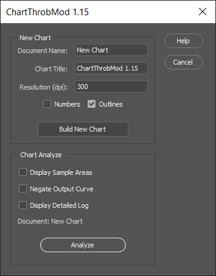
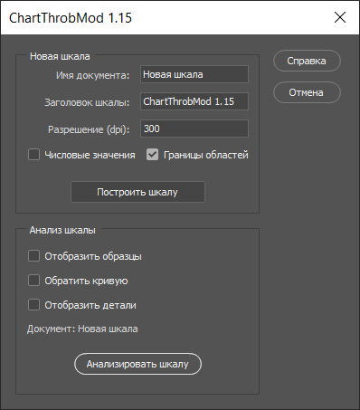

<table><tr><th width="50%">English</th><th>Русский</th></tr>
<tr><td>1. <a href="#introduction">Introduction</a><br>
2. <a href="#installing-chartthrobmod">Installing ChartThrobMod</a><br>
3. <a href="#using-chartthrobmod">Using ChartThrobMod</a>
</td><td>1. <a href="#введение">Введение</a><br>
2. <a href="#установка-chartthrobmod">Установка ChartThrobMod</a><br>
3. <a href="#использование-chartthrobmod">Использование ChartThrobMod</a>
</td></tr></table>

## Introduction

**ChartThrobMod** is the *modified*  version of the original [ChartThrob](https://github.com/joker-b/ChartThrob) script created by [Kevin Bjorke](http://www.botzilla.com/gearhead/2006/10/24/ChartThrob-A-Tool-for-Printing-Digital-Negatives.html), a Photoshop-based tool for creating and managing digital negatives/positives for much alternative-process printing such as platinum printing, ambrotype, cyanotype, gumoil, etc.

### Improvements



Original ChartThrob script functionality is preserved in totality. However, the following improvements were made:

* Removed user tracking functionality.
* Redesigned GIU of both the main & help window.
* Added localization (with the ability to use additional languages).
* Usability improvements:
  - The main script window is displayed automatically after closing the help window (no need to re-run the script again manually).
  - A progress bar is displayed for each stage of the script actions.
  - There is a text field with detailed info in the report window instead of "Excessive Messages" and its multiple alerts.
  - Links in the UI are highlighted and clickable.

### Localization
The locale of Photoshop is used as the default. However, you can change it. To do this, you have to change the value of the variable `$ .locale` to the required language code. For example, using English you need to set:

```javascript
$.locale = 'en';
```
There are two languages provided in the script, English, and Russian. If necessary, the list of languages can be expanded by adding new string translations in the code.

## Installing ChartThrobMod

1. Either clone this GitHub repository or download as a .zip file.
1. Copy the file **ChartThrobMod.jsx** into your Photoshop scripts directory, which will typically be something like `...\Adobe Photoshop CS6 (64 Bit)\Presets\Scripts`.

That's it! The next time you start Photoshop, item `ChartThrobMod` will appear as an option under Photoshop's `File > Scripts` menu.

You can also run **ChartThrobMod** using `File > Scripts > Browser...` menu. In this case, just select the file and click the `Ok` button.

## Using ChartThrobMod

**ChartThrobMod** is really two scripts in one. First, it's a script for _creating_ grayscale calibration charts. Second, it's a tool for automatically _evaluating_ scanned prints of those charts and setting up appropriate profiles depending on the nature of your printing process.

The **ChartThrobMod** workflow has a few basic steps:

1. *Create* a Grayscale chart in _ChartThrob_.
1. *Print* a digital negative/positive from that chart.
1. *Contact-print* that chart onto your medium of choice.
1. *Scan* the resultant print.
1. *Crop* the scan back to the original chart boundaries.
1. *Analyze* the chart in **ChartThrobMod** -- the result will be a new Curves layer containing a *Printing Curve*, which you can use on the spot or save for repeated use later.
1. *Apply* that curve to any B&W images you like, before printing them to digital negatives/positive. The curve will correct the original image grayscale values to neatly fit to the grayscale range of your chosen medium.

You can find more info on the original [ChartThrob's repository](https://github.com/joker-b/ChartThrob) and [Kevin Bjorke's site](http://www.botzilla.com/gearhead/2006/10/24/ChartThrob-A-Tool-for-Printing-Digital-Negatives.html).

## Введение

**ChartThrobMod** представляет собой *модифицированную* версию оригинального сценария [ChartThrob](https://github.com/joker-b/ChartThrob), созданного [Кевином Бьорке](http://www.botzilla.com/gearhead/2006/10/24/ChartThrob-A-Tool-for-Printing-Digital-Negatives.html). Это Photoshop-инструмент для создания цифровых негативов/позитивов, используемых в альтернативных фотопроцессах, таких как платиновая печать, амбротипия, цианотипия, гумойл и др.

### Внесенные изменения



Оригинальная функциональность сценария ChartThrob сохранена полностью, однако были внесены следующие изменения:

- Удалена функция отслеживания пользователей.
- Переработан интерфейс главного окна и окна справки.
- Добавлена локализация интерфейса (с возможностью использовать дополнительные языки).
- Повышение юзабилити:
   - После закрытия окна справки, главное окно сценария отображается автоматически (без его повторного запуска вручную).
   - Отображение индикатор выполнения для каждого этапа работы сценария.
   - Вместо многочисленных извещений, вся техническая информация отображается в текстовом поле окна отчета.
   - Ссылки в пользовательском интерфейсе выделены цветов и кликабельны.

### Локализация

По умолчанию, используется язык интерфейса, выбранный для Photoshop. Однако нужный язык можно указать принудительно. Для этого необходимо изменить значение переменной `$.locale` на код нужного языка. Например, для установки русского языке нужно указать:

```javascript
$.locale = 'ru';
```

В сценарии предусмотрена локализация на два языка - английский и русский. При необходимости список языков можно расширить, добавив в код перевод для используемых строк.

## Установка ChartThrobMod

1. Клонируйте данный репозиторий GitHub, либо скачайте его в виде zip-файла.
1. Скопируйте файл **ChartThrobMod.jsx** в каталог со сценариями Photoshop, который обычно находится по адресу: `...\Adobe Photoshop CS6 (64 Bit)\Presets\Scripts`.

Готово! При следующем запуске Photoshop, в меню `Файл > Сценарии` появится пункт `ChartThrobMod`.

**ChartThrobMod** также можно запускать, используя меню `Файл > Сценарии > Обзор...`. В этом случае просто выберите файл и нажмите кнопку `Ок`.

## Использование ChartThrobMod

**ChartThrobMod** -- это, по сути, два сценария в одном. Первый используется для _создания_ калибровочной шкалы (фотографического клина) в градациях серого, второй -- является инструментом автоматического _анализа_ отсканированного отпечатка калибровочной шкалы и создания компенсационной кривой.

Работа с **ChartThrobMod** состоит из следующих шагов:

1. _Создать_ калибровочную шкалу в оттенках серого при помощи **ChartThrobMod**.
1. _Распечатать_ цифровой негатив/позитив полученной шкалы.
1. _Выполнить контактную печать_ на носителе фотопроцесса при помощи распечатанной шкалы.
1. _Отсканировать_ полученный фотоотпечаток.
1. _Обрезать_ отсканированное изображение до исходных границ калибровочной шкалы.
1. _Проанализировать_ изображение отпечатка шкалы при помощи **ChartThrobMod**. Результатом будет новый корректирующий слой кривых, содержащий кривую для печати. Данную кривую можно применить для печати сразу же или сохранить для повторного использования.
1. _Применить_ полученную кривую к любому черно-белому цифровому изображению перед печатью. Кривая компенсирует исходные значения оттенков серого для точного соответствия диапазону доступных оттенков используемого фотопроцесса.

Дополнительная информация представлена в [репозитории ChartThrob](https://github.com/joker-b/ChartThrob) и на [сайте Кевина Бьорке](http://www.botzilla.com/gearhead/2006/10/24/ChartThrob-A-Tool-for-Printing-Digital-Negatives.html).
